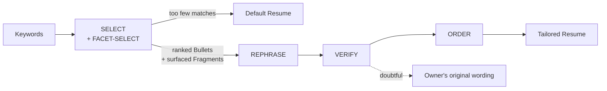

# Resume Generator

**A resume that rewrites itself for the role — without ever inventing a fact.**

An HR user types a few keywords ("backend, Go, latency"). The app returns a resume
built from the owner's *real* experience: the relevant accomplishments, the relevant
details inside each one, phrased toward that role. The engine selects and rewords
pre-written truth. It never authors facts.

English · [繁體中文](README.zh-TW.md)

---

## The idea

Most "AI resume" tools hand the whole job to a model and hope it doesn't embellish.
This one splits the job so truthfulness is checkable at every seam.

Each accomplishment is a **Bullet**, and each Bullet is authored as a set of
**Fragments** — small, independently-omittable true statements:

```yaml
- fragments:
    - text: Designed and shipped a Python API
      core: true            # the spine — always rendered
    - text: serving 2M requests/day
    - text: at p99 under 80ms
  default: true
```

The same accomplishment then reads differently for a backend role, a latency role,
and a leadership role — because the engine **surfaces a different subset of your own
words**, not because it made anything up. The value lives in how you cut the
Fragments; see [the authoring guide](docs/resume-data-format.md).

## How it works



| Stage | What it does | Model |
| --- | --- | --- |
| **SELECT** | Ranks Bullets by relevance to the keywords, and picks which additive Fragments surface. It can only *choose* from real Bullets — returned IDs are verified against the data. | `claude-haiku-4-5` |
| **REPHRASE** | Rewords the surfaced Fragments toward the keywords, strictly one rewrite per input Bullet. | `claude-sonnet-5` |
| **VERIFY** | A deterministic gate rejects any rewrite introducing a number or proper noun absent from the source; survivors go to an LLM judge that catches subtler distortions (`led` → `founded`). | `claude-haiku-4-5` |
| **ORDER** | Groups surviving Bullets by Position (reverse-chronological), relevance-ordered within each. Empty Positions are dropped. | — |

**Failure is a downgrade, not an error.** Anything doubtful reverts to the owner's
own wording. If REPHRASE or JUDGE is unavailable, every Bullet falls back to the
original text and the page still renders. If the keywords clear no relevance floor,
you get the **Default Resume** — the owner's strongest general Bullets — instead of a
thin page. Rationale in [ADR 0006](docs/adr/0006-per-stage-llm-failure-semantics.md).

## Quick start

```bash
npm install
cp .env.example .env.local   # fill in ANTHROPIC_API_KEY
npm run dev
```

Open http://localhost:3000. Only `ANTHROPIC_API_KEY` is required — without Upstash
credentials the cache, rate limiter, and spend cap run against an in-memory store.

## Your data

Experience lives in **`resume.data.yaml`** (sample data, committed). Create
`resume.data.local.yaml` for your real data — it is gitignored, and the loader
prefers it when present.

Read [docs/resume-data-format.md](docs/resume-data-format.md) before editing: it is
the single source of truth for the format, and it carries the rules a schema can't
enforce (how to cut Fragments, what must never be split). The machine-checked
contract is the Zod schema in [lib/data.ts](lib/data.ts). Validate your edits with:

```bash
npm run typecheck && npm run test
```

## Cost & abuse controls

A cache miss can fire three paid Claude calls, and `/api/generate` is public. The
guards run cheapest-first, so nothing pays until it must
([ADR 0003](docs/adr/0003-token-cost-control-strategy.md)):

| Guard | Default |
| --- | --- |
| Per-IP rate limit | 5 requests / 60s |
| Result cache | 30-day TTL; keys are normalized so `"Backend, Go"` and `"go backend"` share one entry |
| Daily spend cap | 50 cache-miss requests per UTC day (`DAILY_REQUEST_CAP`) |
| Input length cap | 200 characters, rejected before any LLM call |

Editing your data changes `dataHash`, which invalidates the cache instantly — so the
long TTL is a hit-rate knob, not a staleness risk.

## Deploy

Vercel, deployed **prebuilt** from your machine so the real data ships inside the
function bundle and never enters git
([ADR 0005](docs/adr/0005-prebuilt-cli-deploy-for-real-data.md)):

```bash
vercel build --prod && vercel deploy --prebuilt --prod
```

Set `ANTHROPIC_API_KEY` and the `UPSTASH_REDIS_REST_*` pair in the Vercel project —
Upstash is required in production, where serverless functions keep no memory.

## Layout

```
app/                 Next.js App Router — landing page, /result, POST /api/generate
lib/data.ts          YAML loader, Zod schema, Bullet/Fragment IDs, dataHash
lib/engine/          select · rephrase · verify · order · generate (pure, injectable)
lib/llm.ts           The only module that talks to Claude; one adapter per stage
lib/protect.ts       Rate limit, result cache, daily spend cap
lib/contract.ts      Types-only wire contract shared by the route and the browser
docs/adr/            Why the design is what it is
```

The engine takes its LLM stages as injected dependencies, so the whole pipeline is
tested with fakes — including a fabrication fixture that asserts zero facts absent
from the source across many keyword sets. 147 unit tests, plus Playwright E2E:

```bash
npm run test       # vitest
npm run test:e2e   # playwright
```

## Docs

- [CONTEXT.md](CONTEXT.md) — the domain vocabulary (Owner, Bullet, Fragment, Surfaced…)
- [docs/resume-data-format.md](docs/resume-data-format.md) — data format & authoring guide
- [docs/adr/](docs/adr/) — architecture decisions, 0001–0006
- [CHANGELOG.md](CHANGELOG.md) — release history
