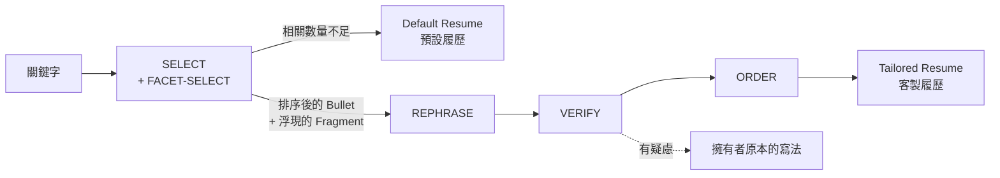

# Resume Generator（履歷產生器）

**一份會為職缺改寫自己的履歷——而且絕不捏造任何事實。**

HR 輸入幾個關鍵字（「backend、Go、latency」），這個網站就回傳一份用擁有者**真實經歷**
組成的履歷：挑出相關的成就、挑出成就裡相關的細節，再用貼近該職缺的語氣寫出來。
引擎只做「挑選」與「改寫」既有的事實，永遠不自己編寫事實。

[English](README.md) · 繁體中文

---

## 核心概念

多數 AI 履歷工具把整件事丟給模型，然後祈禱它不要誇大。這個專案把工作拆開，讓
「沒有捏造」在每個接縫都可以被檢查。

每一個成就是一則 **Bullet**，而每則 Bullet 由多個 **Fragment** 組成——各自獨立、
拿掉也不會讓剩下內容失真的真實敘述：

```yaml
- fragments:
    - text: Designed and shipped a Python API
      core: true            # 主幹（core）——永遠會被渲染
    - text: serving 2M requests/day
    - text: at p99 under 80ms
  default: true
```

同一則成就，對後端職缺、對效能職缺、對管理職缺會讀起來不一樣——因為引擎
**浮現的是你自己文字的不同子集**，不是因為它掰了東西。價值來自你怎麼「切」
Fragment，寫法請見[資料格式指南](docs/resume-data-format.md)。

## 運作方式



| 階段 | 做什麼 | 模型 |
| --- | --- | --- |
| **SELECT** | 依關鍵字排序 Bullet 的相關性，並決定哪些附加 Fragment 要浮現。它只能從**真實存在**的 Bullet 中挑選，回傳的 ID 會逐一驗證。 | `claude-haiku-4-5` |
| **REPHRASE** | 把浮現的 Fragment 改寫成貼近關鍵字的一句話，嚴格一進一出。 | `claude-sonnet-5` |
| **VERIFY** | 先用確定性檢查擋掉任何來源沒有的數字或專有名詞；通過的再交給 LLM 裁判，抓更細微的扭曲（`led` → `founded`）。 | `claude-haiku-4-5` |
| **ORDER** | 依 Position（職位）分組並倒序排列，組內依相關性排序，空的 Position 直接拿掉。 | — |

**出事時是降級，不是報錯。** 任何有疑慮的改寫都退回擁有者原本的用字；REPHRASE 或
JUDGE 整個掛掉時，所有 Bullet 一律退回原文，頁面照樣正常呈現。若關鍵字的相關性
不到門檻，回傳的是 **Default Resume**（擁有者標記的代表作），而不是一頁空殼。
理由記在 [ADR 0006](docs/adr/0006-per-stage-llm-failure-semantics.md)。

## 快速開始

```bash
npm install
cp .env.example .env.local   # 填入 ANTHROPIC_API_KEY
npm run dev
```

打開 http://localhost:3000。只有 `ANTHROPIC_API_KEY` 是必填；沒有 Upstash 憑證時，
快取、流量限制與花費上限會改用行程內記憶體，本機開發不需要另外開服務。

## 你的履歷資料

經歷資料放在 **`resume.data.yaml`**（範例資料，會進 git）。真實資料請另外建立
`resume.data.local.yaml`——它被 gitignore，載入時會優先使用。

動手改之前請先讀 [docs/resume-data-format.md](docs/resume-data-format.md)：那是格式的
唯一真實來源，也寫了 schema 無法強制的規則（Fragment 該怎麼切、哪些東西絕對不能拆開）。
機器檢查的契約則是 [lib/data.ts](lib/data.ts) 裡的 Zod schema。改完請驗證：

```bash
npm run typecheck && npm run test
```

## 成本與濫用防護

一次 cache miss 最多會打三次付費的 Claude API，而 `/api/generate` 是公開端點。
防護由便宜到貴依序執行，能不花錢就不花
（[ADR 0003](docs/adr/0003-token-cost-control-strategy.md)）：

| 防護 | 預設值 |
| --- | --- |
| 單 IP 流量限制 | 60 秒 5 次 |
| 結果快取 | TTL 30 天；key 經過正規化，`"Backend, Go"` 與 `"go backend"` 共用同一筆 |
| 每日花費上限 | 每個 UTC 日 50 次 cache miss（`DAILY_REQUEST_CAP`） |
| 輸入長度上限 | 200 字元，在任何 LLM 呼叫前就擋下 |

改動履歷資料會改變 `dataHash`，快取立即失效——所以長 TTL 是命中率的旋鈕，
不是資料過期的風險。

## 部署

部署到 Vercel，而且是從本機**預先建置（prebuilt）**上傳，讓真實資料包在 function
bundle 裡、永遠不進 git
（[ADR 0005](docs/adr/0005-prebuilt-cli-deploy-for-real-data.md)）：

```bash
vercel build --prod && vercel deploy --prebuilt --prod
```

記得在 Vercel 專案設定 `ANTHROPIC_API_KEY` 與 `UPSTASH_REDIS_REST_*`——正式環境
必須要有 Upstash，因為 serverless function 之間不共用記憶體。

## 專案結構

```
app/                 Next.js App Router——首頁、/result、POST /api/generate
lib/data.ts          YAML 載入、Zod schema、Bullet/Fragment ID、dataHash
lib/engine/          select · rephrase · verify · order · generate（純函式、可注入）
lib/llm.ts           唯一會跟 Claude 對話的模組，每個階段一個 adapter
lib/protect.ts       流量限制、結果快取、每日花費上限
lib/contract.ts      route 與瀏覽器共用的 types-only 傳輸契約
docs/adr/            為什麼這樣設計
```

引擎把 LLM 各階段當成注入的相依，所以整條流程都能用假實作測試——包含一個
「捏造偵測」的 fixture，跨多組關鍵字斷言輸出沒有任何來源不存在的事實。
147 個單元測試，另有 Playwright E2E：

```bash
npm run test       # vitest
npm run test:e2e   # playwright
```

## 文件

- [CONTEXT.md](CONTEXT.md)：領域詞彙（Owner、Bullet、Fragment、Surfaced……）
- [docs/resume-data-format.md](docs/resume-data-format.md)：資料格式與撰寫指南
- [docs/adr/](docs/adr/)：架構決策紀錄 0001–0006
- [CHANGELOG.md](CHANGELOG.md)：版本紀錄

## 授權

[MIT](LICENSE) © James Kuo
